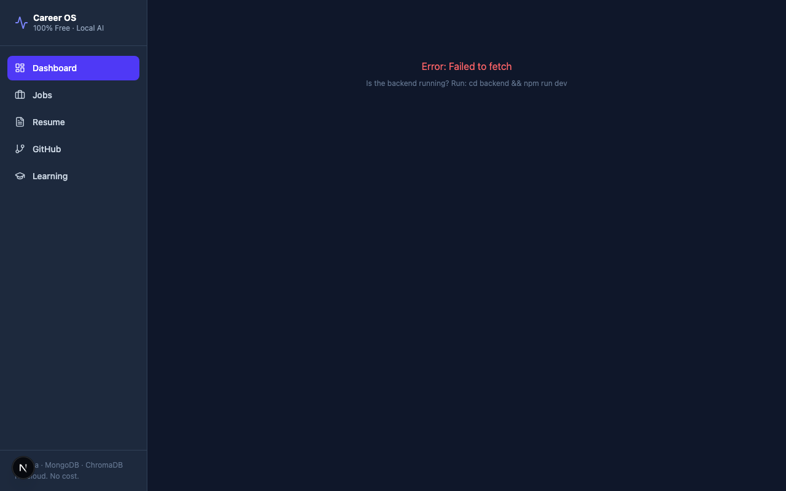
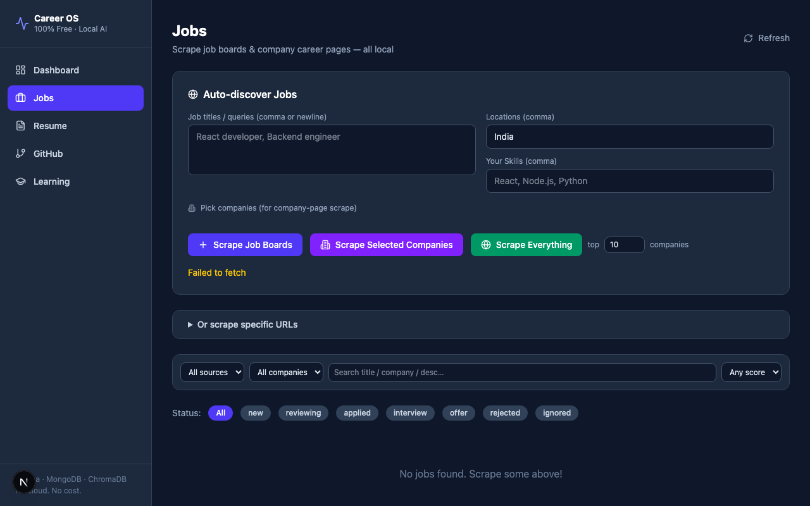
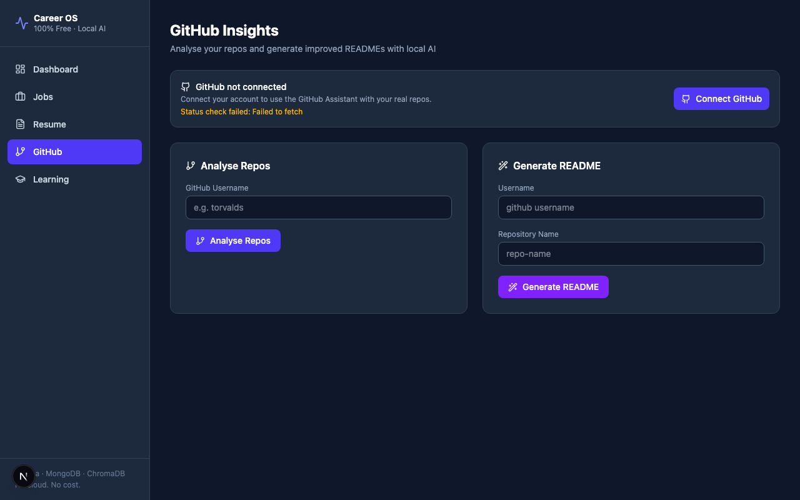
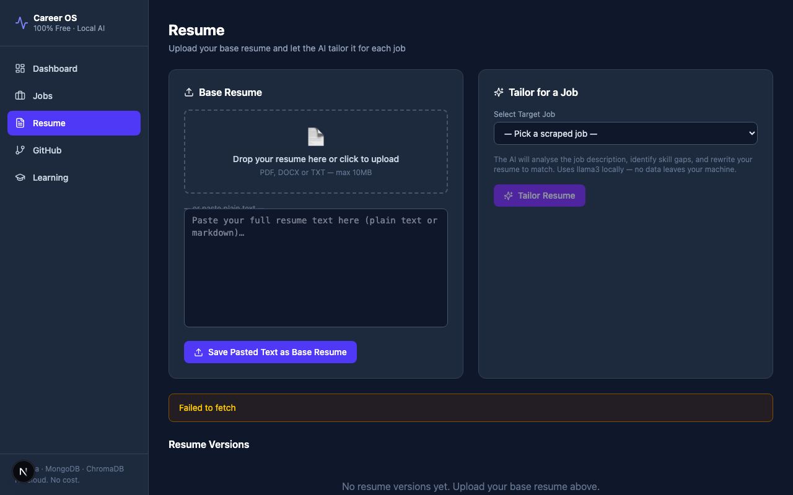
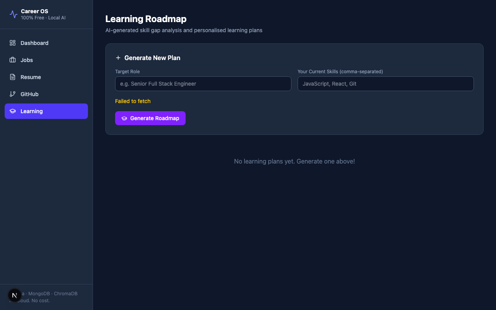

# Career OS Frontend

> Autonomous Career OS — A fully local, zero-cost AI dashboard for automated job search, resume tailoring, and skill roadmap generation.

---

## Overview

**Career OS Frontend** is the responsive web interface for the Autonomous Career OS platform. Built with **Next.js 16**, **React 19**, and **Tailwind CSS**, it connects to a local AI and database backend to provide job scraping, resume tailoring, GitHub analysis, and personalized learning roadmaps. It operates 100% locally with zero paid services by leveraging local AI models (via Ollama) and local databases.

---

## Features

- **📊 Centralized Dashboard**: Real-time stats on jobs applied, resumes tailored, GitHub analysis status, and active learning plans.
- **🔍 Job Scraping Hub**: Scrape LinkedIn, Indeed, Instahyre, and Unstop based on keywords, skills, and locations, storing jobs locally.
- **📄 AI Resume Tailoring**: Upload a base PDF/text resume and automatically optimize it to target specific job descriptions using local LLMs.
- **🐙 GitHub Integration**: Analyze repositories, profile stats, and automatically generate READMEs or portfolio improvements.
- **📚 Local Learning Plans**: Generate interactive structured roadmaps for learning new technologies based on job requirements.

---

## Tech Stack

- **Framework**: Next.js 16 (App Router, Turbopack)
- **Library**: React 19
- **Styling**: Tailwind CSS, Lucide React (Icons)
- **API Communication**: Native fetch, Socket.io-client (for real-time scraping & agent logs)
- **AI Models (Backend-dependent)**: Llama 3.2 (Reasoning/Fast), Nomic Embed Text (Embeddings) via local **Ollama**
- **Databases (Backend-dependent)**: MongoDB (Jobs & Applications), ChromaDB (Vector database for semantic resume parsing)

---

## Folder Structure

```text
frontend/
├── docs/
│   └── images/
│       ├── home.png
│       ├── jobs.png
│       ├── github.png
│       ├── resume.png
│       └── learning.png
├── public/
├── src/
│   ├── app/
│   │   ├── github/          # GitHub analysis and README generator
│   │   ├── jobs/            # Job board, scraper control, status board
│   │   ├── learning/        # AI learning roadmaps and checklists
│   │   ├── resume/          # Resume parser and tailoring module
│   │   ├── globals.css      # Core styles & Tailwind directives
│   │   ├── layout.tsx       # Sidebar wrapper & root layout
│   │   └── page.tsx         # Dashboard landing page
│   ├── components/
│   │   ├── GitHubConnect.tsx # OAuth and status card
│   │   └── Sidebar.jsx      # Navigation sidebar
│   └── lib/
│       └── api.js           # API endpoints & fetch wrapper
├── package.json
├── tsconfig.json
└── next.config.ts
```

---

## Installation

### Prerequisites

- **Node.js**: `>= 18.0.0`
- **npm** or **yarn**

### Steps

1. Navigate to the frontend directory:
   ```bash
   cd career-os-free/frontend
   ```

2. Install the dependencies:
   ```bash
   npm install
   ```

---

## Running the Project

### Development Mode

To run the Next.js app locally in development mode:
```bash
npm run dev
```
The application will be accessible at [http://localhost:3000](http://localhost:3000).

### Production Build

To build the application for production:
```bash
npm run build
npm start
```

---

## Screenshots

### Dashboard


### Job Board & Scraper


### GitHub Analysis


### AI Resume Tailoring


### Learning Plans


---

## Workflow

1. **Dashboard Overview**: View your overall application metrics and quick status charts.
2. **Scraping Jobs**: Go to **Jobs**, trigger a crawl for positions matching your profile, and see them load in real-time.
3. **Optimizing Resumes**: Go to **Resume**, upload your current resume, click a job from the scraped list, and click "Tailor Resume" to generate a tailored copy.
4. **GitHub Sync**: Connect your GitHub profile to analyze public contributions and generate customized repository descriptions.
5. **Skill Roadmap**: Select target skills you are missing to instantly generate a local checklist-based study guide under **Learning**.

---

## Future Improvements

- [ ] Add direct PDF export for tailored resumes.
- [ ] Add dark mode support and custom theme selector.
- [ ] Add automatic email application drafting inside the tailored page.

---

## Author

- **GitHub Profile**: [Vaishnavi Dubey](https://github.com/Vaishnavi-Dubey)

---

## License

This project is licensed under the MIT License.
